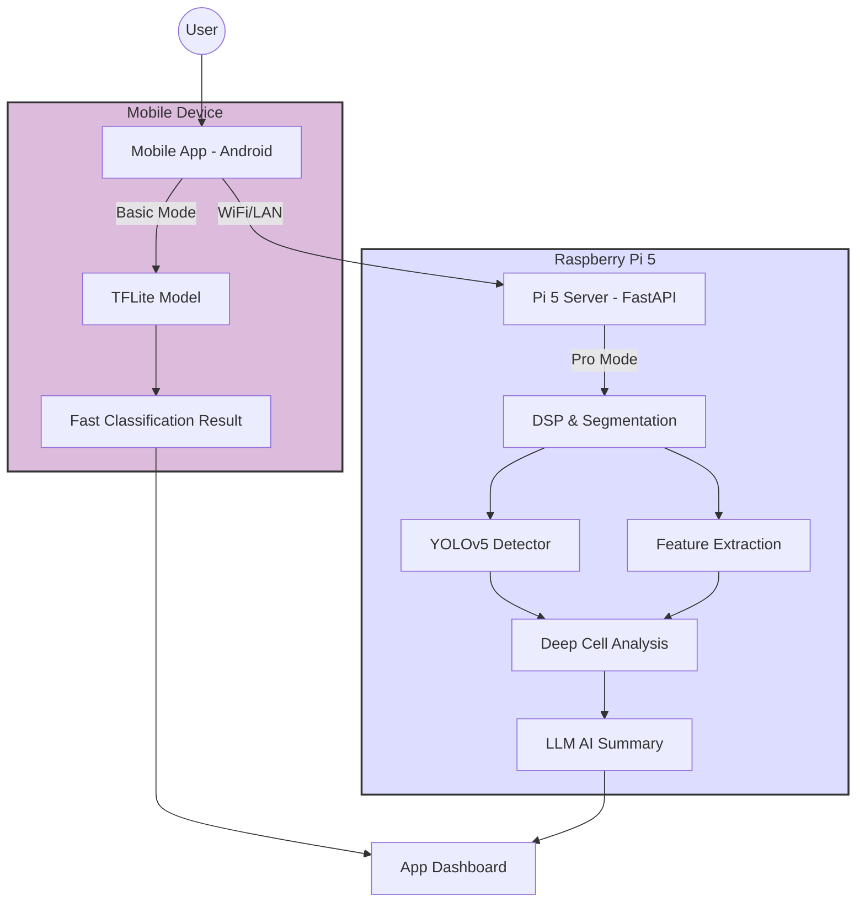

# ALL Detection Mobile App - Implementation Plan

## Goal
Build a mobile app (Android) with **on-device TFLite** for basic analysis, plus **Pro Mode** connecting to Pi 5 for advanced V5 detection.

---

## Project Structure

> **Important:** Mobile app in **separate folder**, buildable via Android Studio.

```
c:\Open Source\
├── leukiemea/                    # Existing Pi/Python project
│   ├── src/
│   │   ├── api/
│   │   │   └── server.py         # NEW: FastAPI for Pro Mode
│   │   ├── detection/            # Existing V5, TFLite
│   │   └── ui/                   # Existing desktop UI
│   └── requirements.txt
│
└── all-detection-app/            # NEW: Android app (separate repo)
    ├── app/
    │   ├── src/main/
    │   │   ├── java/.../
    │   │   ├── res/
    │   │   └── assets/
    │   │       └── all_nano_33_ble_sense.tflite
    │   └── build.gradle
    ├── build.gradle
    └── settings.gradle
```

---

---

## System Architecture



---

## Detection Process Flow (Idealized)

```mermaid
graph LR
    Img[Input Image] --> Pre[Pre-processing]
    
    subgraph "Pi 5 Processing Pipeline"
        Pre --> Seg[DSP & Segmentation<br/>(K-Means + Watershed)]
        Seg --> Feat[Feature Extraction<br/>(Geometric & Color)]
        Feat --> Class[Classification<br/>(TFLite + YOLOv5)]
    end
    
    Class --> Report[Clinical Report Output]
    
    style Seg fill:#dfd,stroke:#333,stroke-width:2px
    style Class fill:#fdd,stroke:#333,stroke-width:2px
```

---

## Technology Stack

| Component | Choice |
|-----------|--------|
| **Mobile** | Native Android (Kotlin) + TFLite |
| **Pi API** | FastAPI (Python) |
| **Discovery** | mDNS / Manual IP |

---

## Modes

| Mode | Where | Features |
|------|-------|----------|
| **Basic** | Phone | TFLite full-image, instant results |
| **Pro** | Pi 5 | V5 per-cell, LLM summary, detailed metrics |

---

## Pi API (Pro Mode)

**New file:** `src/api/server.py`

```python
from fastapi import FastAPI, UploadFile, File
from src.detection.blast_detector_v5 import detect_blasts
from src.detection.stage1_screening import ALLScreener

app = FastAPI()
screener = ALLScreener()

@app.post("/analyze")
async def analyze(image: UploadFile = File(...)):
    # Save, run pipeline, return JSON
    return {"tflite": {...}, "cells": [...], "summary": "..."}
```

**Run:** `uvicorn src.api.server:app --host 0.0.0.0 --port 8000`

---

## Phases

### Phase 1: MVP (3 days)
- [ ] Create Android project (Kotlin, Android Studio)
- [ ] TFLite integration (full-image)
- [ ] Camera + Gallery picker
- [ ] Basic results UI

### Phase 2: Pro Mode (2 days)
- [ ] Add FastAPI server to Pi (`src/api/server.py`)
- [ ] App: Network discovery / manual IP entry
- [ ] App: Toggle Basic/Pro mode
- [ ] Display detailed V5 results from Pi

### Phase 3: Polish (2 days)
- [ ] UI animations, dark mode
- [ ] Offline indicator
- [ ] Export results (share image + report)

---

## Technical Constraints & Solutions

### 1. Network Security (Android 9+)
**Problem:** Android blocks cleartext (HTTP) traffic by default.
**Solution:** Create `res/xml/network_security_config.xml`:
```xml
<network-security-config>
    <domain-config cleartextTrafficPermitted="true">
        <domain includeSubdomains="true">192.168.1.100</domain> <!-- Pi IP -->
        <domain includeSubdomains="true">raspberrypi.local</domain>
    </domain-config>
</network-security-config>
```

### 2. Timeouts
**Problem:** Pi 5 detection takes ~5-8s. Default okhttp timeout is 10s.
**Solution:** Set Android client timeout to **30 seconds**.
```kotlin
val client = OkHttpClient.Builder()
    .readTimeout(30, TimeUnit.SECONDS)
    .connectTimeout(15, TimeUnit.SECONDS)
    .build()
```

### 3. Image Transfer
**Problem:** Sending large Base64 strings crashes apps.
**Solution:** Use `MultipartBody.Part` to stream file upload.
Resize image to max 1024px on phone before sending to save bandwidth.

---

## API Contract (Pro Mode)

**Endpoint:** `POST /analyze`
**Input:** `multipart/form-data` (key: `image`)

**Output JSON:**
```json
{
  "tflite": {
    "positive": true,
    "confidence": 0.98,
    "classification": "ALL"
  },
  "cells": [
    {
      "id": 1,
      "bbox": [100, 200, 50, 50],
      "classification": "BLAST (L1)",
      "score": 3.45,
      "circularity": 0.88
    }
  ],
  "summary": "High circularity (88%) and score (3.45) strongly suggest ALL."
}
```

---

## Android Dependencies (build.gradle)

```groovy
dependencies {
    // ML
    implementation 'org.tensorflow:tensorflow-lite-task-vision:0.4.4'
    implementation 'org.tensorflow:tensorflow-lite-gpu:2.9.0' (optional)
    
    // Networking
    implementation 'com.squareup.retrofit2:retrofit:2.9.0'
    implementation 'com.squareup.retrofit2:converter-gson:2.9.0'
    
    // UI
    implementation 'io.coil-kt:coil:2.4.0' // Image loading
    implementation 'com.github.GitHubUser:MPAndroidChart:v3.1.0' // Graphs
}
```

---

## Next Steps
1. ✅ Plan approved
2. Create `all-detection-app/` Android project
3. Integrate TFLite model
4. Build Basic Mode MVP
